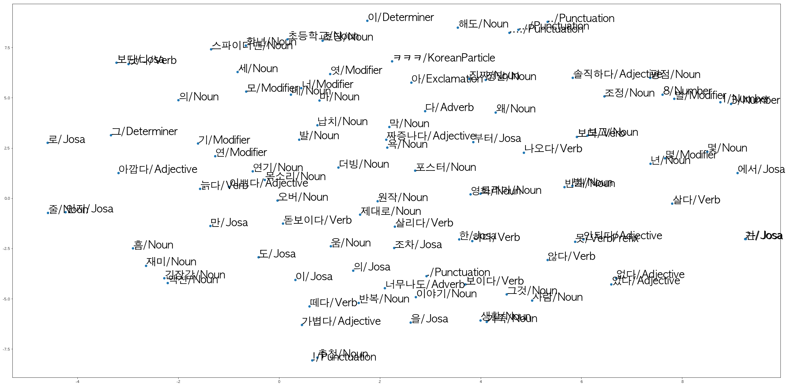

# NLP_Text_Classification_Word2Vec

**캐글 사이트** 에서 다운 받은 positive, negative가 레이블되어 있는 정답이 있는 네이버 영화 리뷰 데이터 15만건([박은정님 제공](https://github.com/e9t/nsmc))을 konlpy 한국어 형태소 분석기를 통하여 전처리 후 벡터 차원에 임베딩 시키는 프로그램

전처리 후 [Eng_Word2Vec_방법](https://github.com/HyungjinLee/NLP_Text_Classification_Word2Vec)과 동일하게 진행하면 모델 학습이 된다.

## 1. Model Structure - Word2Vec

      출처 : https://opensource.googleblog.com/2013/08/learning-meaning-behind-words.html

Word2Vec은 분산 된 텍스트 표현을 사용하여 개념 간 유사성을 본다. 
ex) 파리와 프랑스가 베를린과 독일이 (수도와 나라) 같은 방식으로 관련되어 있음을 나타낸다.

실제로 백터차원에 영화 리뷰 말뭉치들 속에 있는 한글 단어들을 임베딩 한 것이다.

## 2. Requirement
- [BeautifulSoup 4](https://www.crummy.com/software/BeautifulSoup/bs4/doc/)
- [konlpy](https://konlpy-ko.readthedocs.io)
- [gensim](https://radimrehurek.com/gensim/)

## 3. Data Sets

- Training data : 네이버 댓글 크롤링한 말뭉치 15만 건 (https://www.kaggle.com/iarunava/imdb-movie-reviews-dataset)

- Test data : 네이버 댓글 크롤링한 말뭉치 5만 건(unlabeld data) (https://www.kaggle.com/iarunava/imdb-movie-reviews-dataset)

= 총 20만 건의 data
